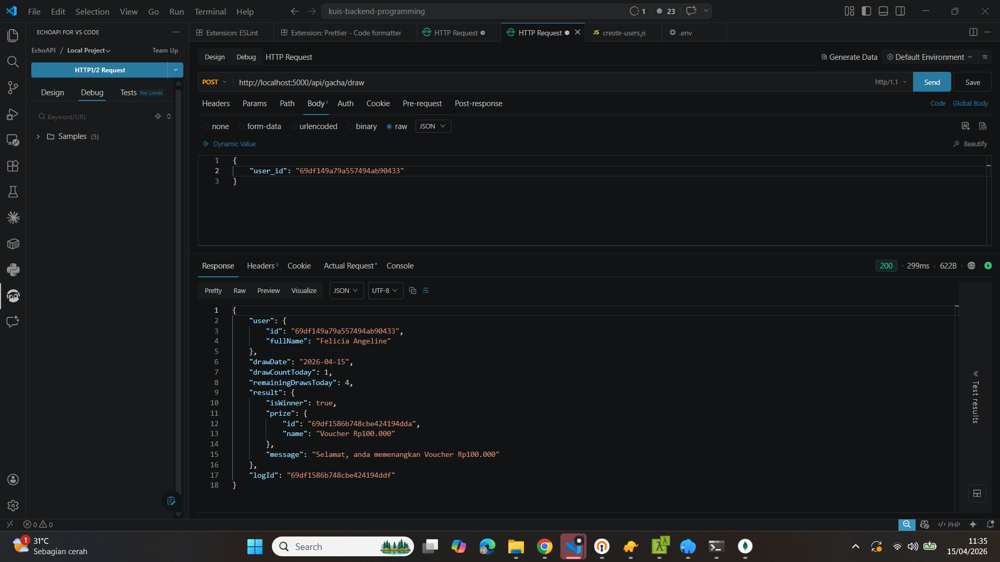
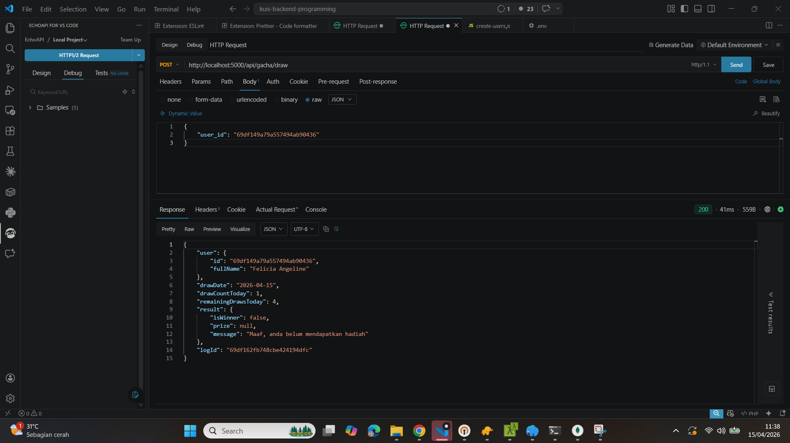
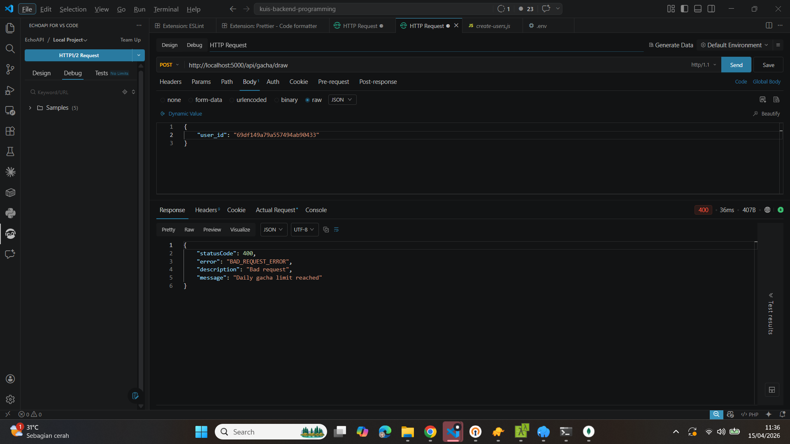
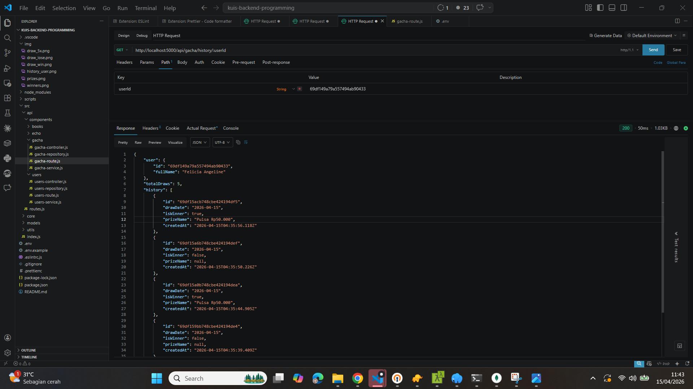
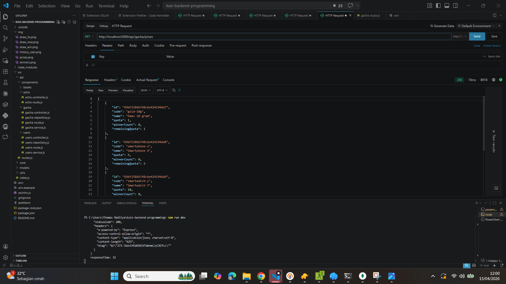
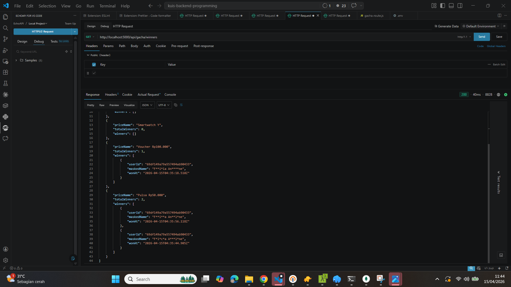

# Kuis Backend Programming 1

Project ini menggunakan template `backend-programming-template-2025` dan menambahkan fitur undian gacha berbasis MongoDB sesuai requirement kuis.

## Setup

1. Copy `.env.example` menjadi `.env`.
2. Isi konfigurasi MongoDB pada `.env`.
3. Install dependency:

```bash
npm install
```

4. Jalankan server:

```bash
npm run dev
```

5. Jalankan test:

```bash
npm test
```

Base URL API:

```text
http://localhost:PORT/api
```

Contoh jika `PORT=5001`:

```text
http://localhost:5001/api
```

## Konfigurasi Environment

Isi `.env`:

```env
PORT=5001
DB_CONNECTION=mongodb://127.0.0.1:27017
DB_NAME=kuis
```

## Gacha API

### Aturan Sistem

- Setiap user hanya bisa gacha maksimal `5 kali` per hari.
- Semua histori gacha disimpan ke MongoDB.
- Kuota hadiah berlaku untuk `1 periode undian`, bukan kuota harian.
- Jika kuota hadiah habis, hadiah tersebut tidak bisa dimenangkan lagi.
- Daftar hadiah default akan dibuat otomatis saat endpoint gacha pertama dipanggil.

### Daftar Hadiah

| Hadiah            | Kuota Pemenang |
| ----------------- | -------------: |
| Emas 10 gram      |              1 |
| Smartphone X      |              5 |
| Smartwatch Y      |             10 |
| Voucher Rp100.000 |            100 |
| Pulsa Rp50.000    |            500 |

### `POST /api/gacha/draw`

Menjalankan gacha untuk 1 user.

Request body:

```json
{
  "user_id": "USER_OBJECT_ID"
}
```



Response jika user menang:

```json
{
  "user": {
    "id": "USER_OBJECT_ID",
    "fullName": "Jane Doe"
  },
  "drawDate": "2026-04-12",
  "drawCountToday": 1,
  "remainingDrawsToday": 4,
  "result": {
    "isWinner": true,
    "prize": {
      "id": "PRIZE_OBJECT_ID",
      "name": "Voucher Rp100.000"
    },
    "message": "Selamat, anda memenangkan Voucher Rp100.000"
  },
  "logId": "LOG_OBJECT_ID"
}
```



Response jika user tidak menang:

```json
{
  "user": {
    "id": "USER_OBJECT_ID",
    "fullName": "Jane Doe"
  },
  "drawDate": "2026-04-12",
  "drawCountToday": 1,
  "remainingDrawsToday": 4,
  "result": {
    "isWinner": false,
    "prize": null,
    "message": "Maaf, anda belum mendapatkan hadiah"
  },
  "logId": "LOG_OBJECT_ID"
}
```



Response error jika melebihi 5 kali gacha dalam sehari:

```json
{
  "statusCode": 400,
  "error": "BAD_REQUEST_ERROR",
  "description": "Bad request",
  "message": "Daily gacha limit reached"
}
```

### `GET /api/gacha/history/:userId`




Menampilkan histori gacha user beserta hadiah yang dimenangkan jika ada.

Contoh response:

```json
{
  "user": {
    "id": "USER_OBJECT_ID",
    "fullName": "Jane Doe"
  },
  "totalDraws": 2,
  "history": [
    {
      "id": "LOG_OBJECT_ID_1",
      "drawDate": "2026-04-12",
      "isWinner": true,
      "prizeName": "Pulsa Rp50.000",
      "createdAt": "2026-04-12T08:10:00.000Z"
    },
    {
      "id": "LOG_OBJECT_ID_2",
      "drawDate": "2026-04-12",
      "isWinner": false,
      "prizeName": null,
      "createdAt": "2026-04-12T08:05:00.000Z"
    }
  ]
}
```

### `GET /api/gacha/prizes`



Menampilkan daftar hadiah, kuota total, jumlah pemenang saat ini, dan sisa kuota.

Contoh response:

```json
[
  {
    "id": "PRIZE_ID_1",
    "code": "gold-10g",
    "name": "Emas 10 gram",
    "quota": 1,
    "winnerCount": 0,
    "remainingQuota": 1
  },
  {
    "id": "PRIZE_ID_2",
    "code": "smartphone-x",
    "name": "Smartphone X",
    "quota": 5,
    "winnerCount": 1,
    "remainingQuota": 4
  }
]
```

### `GET /api/gacha/winners`



Menampilkan daftar pemenang untuk setiap hadiah. Nama pemenang disamarkan secara acak.

Contoh response:

```json
[
  {
    "prizeName": "Emas 10 gram",
    "totalWinners": 1,
    "winners": [
      {
        "userId": "USER_OBJECT_ID",
        "maskedName": "J*** D*e",
        "wonAt": "2026-04-12T08:12:00.000Z"
      }
    ]
  },
  {
    "prizeName": "Smartphone X",
    "totalWinners": 0,
    "winners": []
  }
]
```

## Endpoint Lain dari Template

### Books

- `GET /api/books`
- `POST /api/books`

### Users

- `GET /api/users`
- `POST /api/users`
- `GET /api/users/:id`
- `PUT /api/users/:id`
- `PUT /api/users/:id/change-password`
- `DELETE /api/users/:id`

## Verifikasi

- MongoDB dipakai untuk penyimpanan user, prize, dan log gacha.
- Test integration MongoDB tersedia dan dijalankan dengan `npm test`.
- Lint dapat dijalankan dengan `npm run eslint`.
